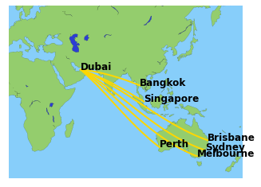
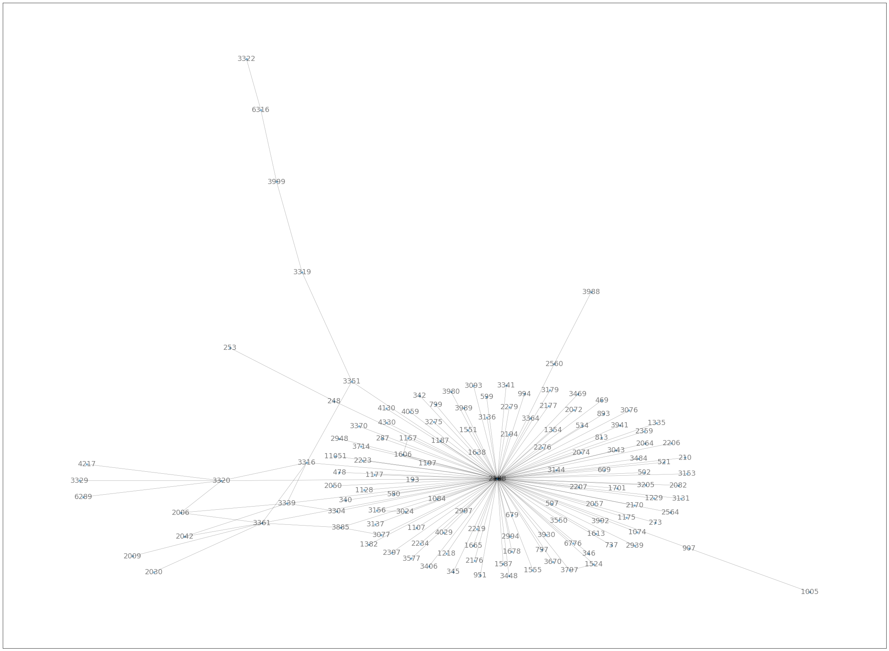
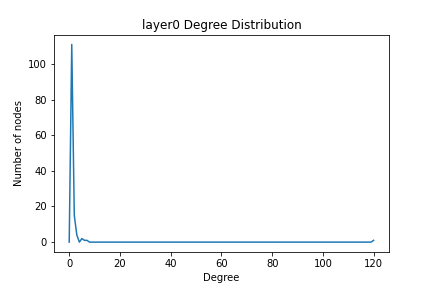
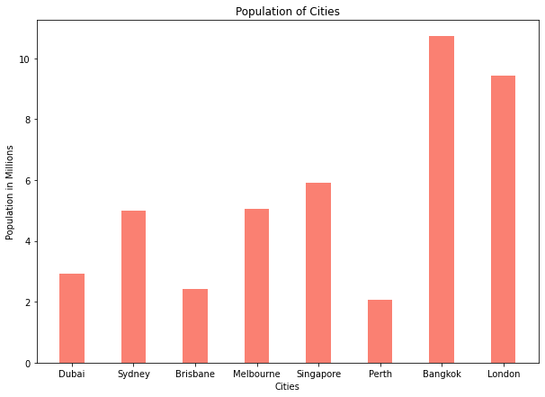

# Airline Route and Hub Analysis

## Overview
This project analyzes airline routes to identify current top hubs, visualize route connections, and predict potential hubs for expansion. Using graph theory and network analysis, the study provides actionable insights into airline operations and network characteristics.

## Objectives
- Analyze the airline's current network to identify top hubs based on connection frequency.
- Visualize the network graph to represent connections between airports.
- Predict potential future hubs based on demographic, operational, and geographic factors.

---

## Tools and Technologies
- **Programming Language**: Python
- **Libraries**: NetworkX, Matplotlib, Pandas, NumPy
- **Tools**: Jupyter Notebook, CSV for data processing

---

## Steps

### 1. **Data Preprocessing**
- Cleaned the raw data to focus on relevant routes and airports.
- Mapped source and destination IDs to airport names.
- Filtered data to include only the airline of interest.

### 2. **Network Graph Analysis**
- Built a multi-layered network graph to represent route connections.
- Computed graph metrics:
  - Number of nodes and edges
  - Density of the graph
  - Degree distribution
  - Connected components

### 3. **Visualizations**
- Generated a network graph for the airline's route connections.
- Created degree distribution plots to understand node connectivity.
- Used bar charts, pie charts, and population plots to present insights.

---

## Visualizations

### 1. Top Hubs by Connection Frequency


### 2. Network Graph of Route Connections


### 3. Degree Distribution


### 4. Population of Potential Hub Cities


---

## Key Findings
- **Top Current Hubs**:
  - **Dubai (DXB)** dominates as the top hub with 80% of connections.
  - Other significant hubs include **Sydney (SYD)**, **Brisbane (BNE)**, and **Singapore (SIN)**.

- **Predicted Next Hub**:
  - Based on population size and strategic location, **London – Heathrow** is identified as the next potential hub.

---

## How to Run

### 1. Clone the Repository
```bash
git clone https://github.com/<your-username>/Airline-Route-Analysis.git
